# Melbourne Housing Price Prediction

## Background

This project is for learning purposes only and was created as part of the Regression section to my Machine Learning Guide. The purpose of this notebook is to display some of the most common, practical and powerful machine leaning techniques and applications used to solve simple data science problems. 

Here we are using the Melbourne housing clearance data from [Kaggle](https://www.kaggle.com/datasets/anthonypino/melbourne-housing-market) to predict housing prices. This dataset is relatively clean however during our data preprocssessing we will use several techniques to handle missing values, encode categorical data and scale our features. This notebook will explore a handful machine learning algorithms and optmization techniques evaluated against classical regression evaluation metrics; here we will use mean absolute error, mean squared error, root mean squared error and r-squared. 

**Please view requirements.txt or environment.yml for project dependences and package version.**

## Tools

* NumPy
* Pandas
* Matplotlib
* Seaborn
* Scikit-Learn
* XGBoost
* Keras/TensorFlow
* PyTorch

## Machine Learning Algorithms 

* Support Vector Regressor
* XGBoost Regressor
* DecisionTree Regression
* RandomForest Regresion
* Lasso
* Ridge
* ElasticNet
* LinearRegression
* SGDRegressor
* Baysiean Ridge
* Keras Neural Net Sequential Model - Dense Layers
* Pytorch Neural Net - Linear layers

## EDA and Data Preprocessing

This notebook begins by introducing some basic exploratory data analysis and data preprocessing. Here we explore our descriptive statistics, get a sense of the shape of our data, its columns and our missing values. Before tackling our missing values several plots are generated with the hope of potentially finding meaning relationships within our data.

We begin by visualizing the distrubution of our target varibale (Price) with seaborn's distplot function

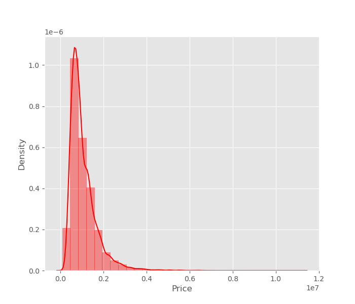

We then use seaborn's heatmap function to view the pearson correlation between our feature and target variables

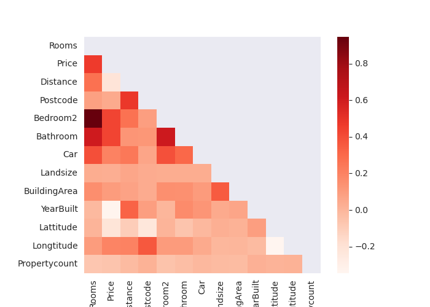

He we can see that features Car, Bathroom, Bedroom, and Longtitude are postively correlated with Price.
Some of these features are further explored using regression and boxplots.

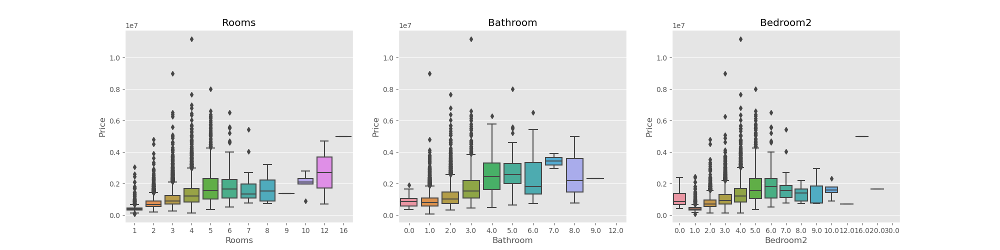 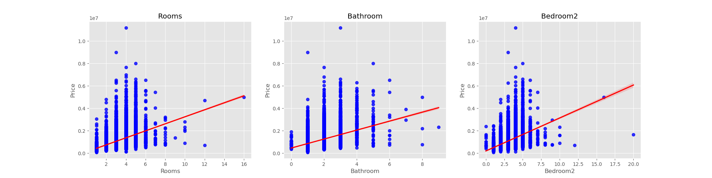

### Feature and Target Selection

After our data visualization we move forward with our Target and Feature selection

Since we are pricting housing prices are target variable is clearly our target (y variable/dependent variable). 

For our features, I have decided to select Rooms, Bathroom, Bedroom2, Type, Distance, Car, Regionname.

Next to continue with our data preprocessing we now tackle our missing values and categorical data.

To handle the missing values instead of simply droping NaNs I have choose to "fill" the missing values with the mean value using sklearn's SimpleImputer. 

To handle our categorical data, sklearn's OneHotEncoder is utitlize and our categorical values are transformed to One Hot values.

Since our target feature also contains missing values we use the pandas built it .fillna() method to fill nulls with the mean price. 

Finally our finally our features are scaled using sklearn's MinMaxScaler

## Model Selection, Training, and Preciction

We begin this section by spliting our data into a training set and a testing set.

We then instantiate a dictionay of several regression models. The purpose of the set-up was to introduce a handful of previously unseen regression algorithms to my students. Additionally this set-up allows us to quickly train and evaluate a number of regression algorithms. 

The models are trained and evaluated using a for loop and the results are printed to the screen

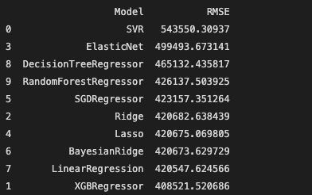

To no one's suprise the XGBRegressor was the best performer having the lowest Root Mean Squared Error of 408421.52

## XGBoost

We then move forward with XGBoost and attempt to optimize the model's performance using Hyperparameter Tuning. 

We define our hyperparameter grid, instantiate our model and fit a RandomSearchCV in an attempt to determine our best parameters for final tuning.

After our final parameters have been deceded the XGBReggressor is ran one final time producing:

**Root Mean Square Error = 392751.50221449**

**Final Results**

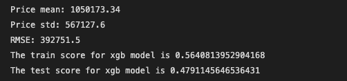

Price Distrubution of XGBRegressor predictors

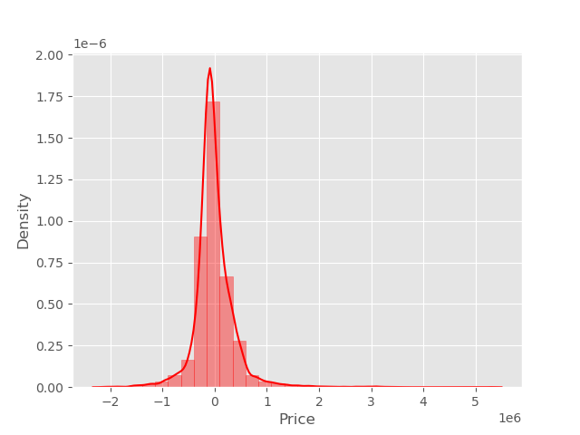

Predicted vs Actual 

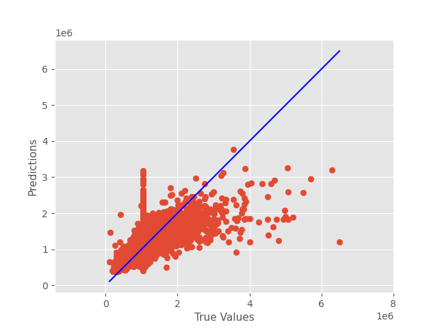

### Pipelines and GridSearchCV

The purpose of this section was to provide my students with an introduction to sklearn Pipelines for efficient machine learning workflow.

Here we are optimizing the Lasso Regression Algorithm

We set up our pipeline by with sklearn's StandardScaler and PloynomialFeatures preprocessing functions. 
We define our parameter grid for our grid search, our cross validation is created using sklearns KFolds method, and as with our XGBReggressor our GridSearchCV is fit to the training data. 
The model is then evaluted using the R-Squared metric producing a score of 0.44590040285242893

## TensorFlow

The next section of this notebook dives into Deep Learning and attemps to predict housing prices using Neural Networks. We first begin by implementing a regression model utilizing the Keras Framework and later with the PyTorch Framework. 

No additional data cleaning or preprocessing is required to implement a Deep Neural Network using our current targer and feature definiitions.

Hence, we begin by defining a Sequential Model with 6 Dense layers and a Dropout Layer. Our Dense hidden layers are activated using the ReLu activation function, and as the is a regression problem our Output Layer with a single neuron is activated using the Linear activation function. 

We are compiling our model with the optimizer set to Adam with a learning rate of 0.01 and we are setting our loss to Mean Absoulute Error. 

Using a batch size of 32 our model is fit on the training data for 250 epochs. Our validation_data is set to our testing set, and a callback paramter is added for EarlyStoping.

After 250 epochs we plot out our leaning curve to measure our train and test losses.

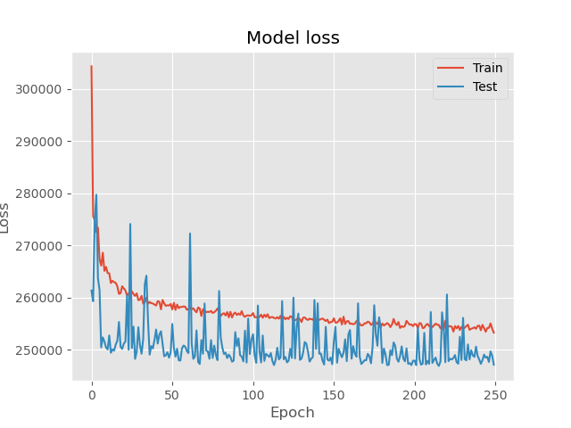

To speed up training we redifine our model using the EarlyStopping callback function with a patience of 3. Here are the Model Loss results

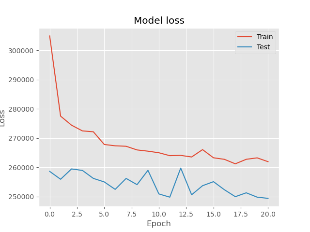

## PyTorch

We begin this section my refining our target and features, and then creating our DNN using PyTorch model class design structure. Here defining our Neural Network with 6 conncted hidden layers intitalized with the Linear PyTorch class. There is also a single dropout layer. Within our forward function each hidden layer is activated using the ReLU activation function. 

Our model is then instantiated and our optimizer and loss are defined using Adam (lr = 0.01) and L1Loss (Mean Absolute Error)

We then convert our data into tensors and PyTorch requires input variables to my tensor.
Next, we set our batch_size to 32 and create iterators to iterate our training and testing data by batch.

Now we train our model over 250 epochs. Our training and validation loss are tracked for model evaluation. Here are the results: 

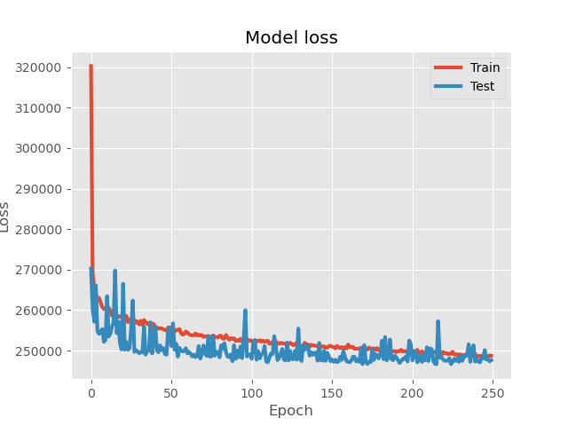

Finally we evaluate our model with torch.no_grad() producing.

**Mean Absolute Error: 247644.29687500**